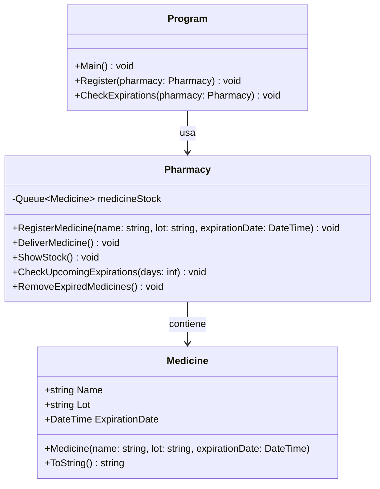
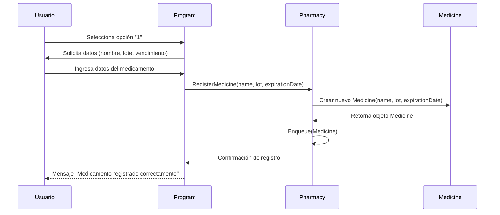

## DIAGRAMA DE 

__*Documentado*__
__Este diagrama de clases representa la estructura y relaciones principales del sistema de gestión de medicamentos:__

*Clase Program*

Actúa como el punto de entrada del sistema.

Métodos principales:

Main() → ejecuta el menú interactivo y controla el flujo del programa.

Register(pharmacy: Pharmacy) → solicita los datos de un medicamento y delega el registro a Pharmacy.

CheckExpirations(pharmacy: Pharmacy) → invoca la verificación de medicamentos próximos a vencer.

Relación: usa Pharmacy para delegar las operaciones sobre los medicamentos.

*Clase Pharmacy*

Gestiona el inventario de medicamentos.

Atributo privado: medicineStock (cola FIFO de objetos Medicine) para mantener el orden de ingreso.

Métodos principales:

RegisterMedicine() → agrega un medicamento al stock.

DeliverMedicine() → entrega el medicamento más antiguo (FIFO).

ShowStock() → muestra todos los medicamentos disponibles.

CheckUpcomingExpirations(days) → lista los medicamentos próximos a vencer.

RemoveExpiredMedicines() → elimina los vencidos del stock.

Relación: contiene Medicine, es decir, maneja múltiples instancias de esta clase.

*Clase Medicine*

Representa un medicamento con sus atributos específicos: Name, Lot y ExpirationDate.

Constructor y método ToString() para instanciar y mostrar la información del medicamento.

## DIAGRAMA DE SECCION

__*Documentado*__
Este diagrama de secuencia representa el flujo de interacción para la operación de registro de un medicamento en el sistema:

El usuario inicia la operación seleccionando la opción de registro en la interfaz de Program.

Program solicita los atributos del medicamento (nombre, lote, fecha de vencimiento) y captura la entrada del usuario.

Program invoca el método RegisterMedicine() de la clase Pharmacy, transmitiendo los datos ingresados.

Pharmacy instancia un objeto de la clase Medicine con los atributos proporcionados.

El objeto Medicine es retornado a Pharmacy, que lo enfila en la estructura de datos Queue para garantizar un control FIFO.

Pharmacy envía una confirmación de registro a Program, que finalmente comunica el éxito de la operación al usuario.

